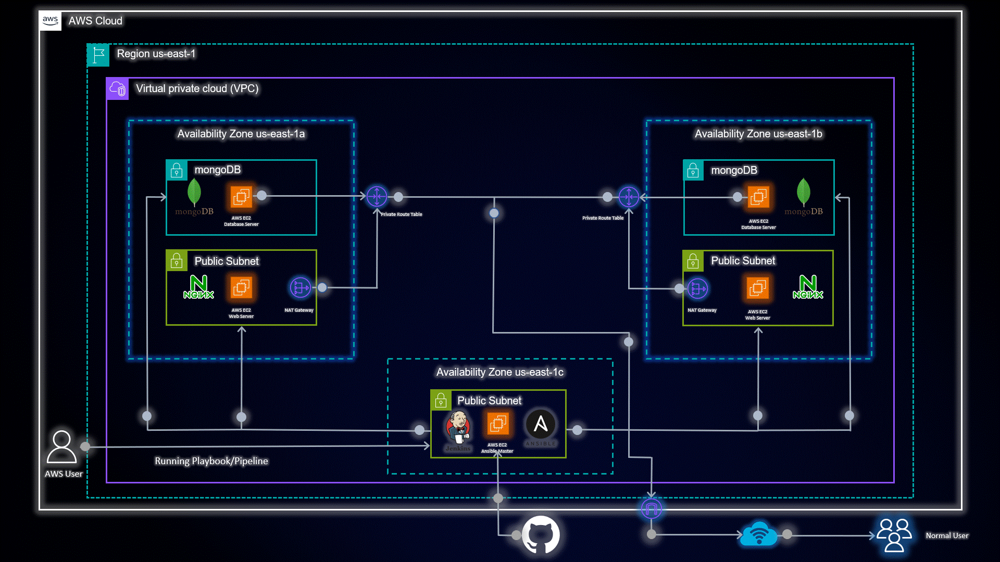

# Project Name

## Overview

This repository contains Ansible playbooks for configuring Nginx and MongoDB, along with a Jenkinsfile for automating the deployment process.

## Table of Contents

- [Jenkins Pipeline](#jenkins-pipeline)
- [Prerequisites](#prerequisites)
- [Getting Started](#getting-started)
- [Nginx Configuration](#nginx-configuration)
- [MongoDB Configuration](#mongodb-configuration)
- [Feedback](#feedback)
- [Contributing](#contributing)
- [License](#license)

## Jenkins Pipeline

The Jenkinsfile in this repository is a declarative Jenkins Pipeline that automates the deployment of Ansible playbooks for both Nginx and MongoDB configurations. Here is an explanation of the stages and their purpose:

1. **Preparing**: A preliminary stage to set up the environment.

2. **Git Pulling**: This stage pulls the latest changes from the repository.

3. **Playbook Initializing**: An intermediary stage for initialization.

4. **Playbook Running**: The main stage that runs the Ansible playbook based on user parameters. The pipeline provides two parameters: "Playbook Name" and "Playbook Action."

   - The "Playbook Name" parameter allows you to specify the name of the Ansible playbook you want to execute, such as "nginx" or "mongodb."
   - The "Playbook Action" parameter offers two choices: "Dry-Run" and "Playbook-deploy." A "Dry-Run" lets you perform a test run without making any changes, while "Playbook-deploy" actually applies the configuration changes.

   Depending on the selected action, the corresponding Ansible playbook will be executed.

5. **Playbook Deployed**: A final stage to indicate that the deployment is complete.

## Prerequisites

Before using this repository, make sure you have the following installed:

- Ansible on the control machine
- Jenkins server with the Ansible plugin installed

## Getting Started

1. Clone this repository to your local machine.
2. To perform specific tasks for Nginx and MongoDB configuration, navigate to the "Nginx Configure" and "MongoDB Configuration" directories, respectively. Each directory contains a dedicated README with instructions for that task.
3. Configure your Jenkins job to accept the specified parameters for the pipeline to function correctly.
4. Execute the Jenkins pipeline to deploy the desired configuration.

